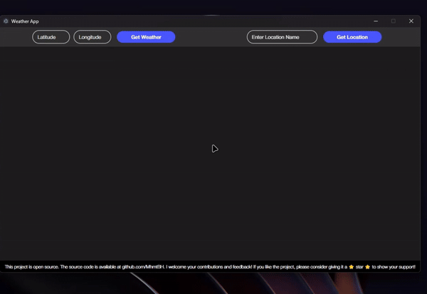

# Weather App

A simple and user-friendly application designed to display weather data.

 

*This is a preview of the Weather App.*

## Features

- Current weather information
- City-based weather search
- User-friendly interface

## Resources

### API

API used for weather data:
- [Open-Meteo](https://open-meteo.com/)

### Images

Images used in the application:
- Background Images: [Unsplash](https://unsplash.com/)

### Framework

This application is built using [Electron](https://www.electronjs.org/), which allows it to run as a desktop application across multiple platforms.

## Installation

You can start by cloning the project to your local machine:

```bash
git clone https://github.com/MhmtBH/Weather-App.git
cd Weather-App
```

To install the necessary dependencies, run:

```bash
npm install
```

## Usage

To start the application, run:

```bash
npm start
```
### How to Use the Application

1. **Open the Application**: Launch the application on your desktop.
2. **Enter Coordinates**: Input the latitude and longitude of the desired location, then click the "Get Weather" button.
3. **Search by Location Name**: Alternatively, enter the name of the location and click the "Get Location" button. 
4. **Select Your Location**: From the results, select your desired location to view detailed weather information.

## License

This project is licensed under the MIT License. For more information, please refer to the [LICENSE](LICENSE) file.
